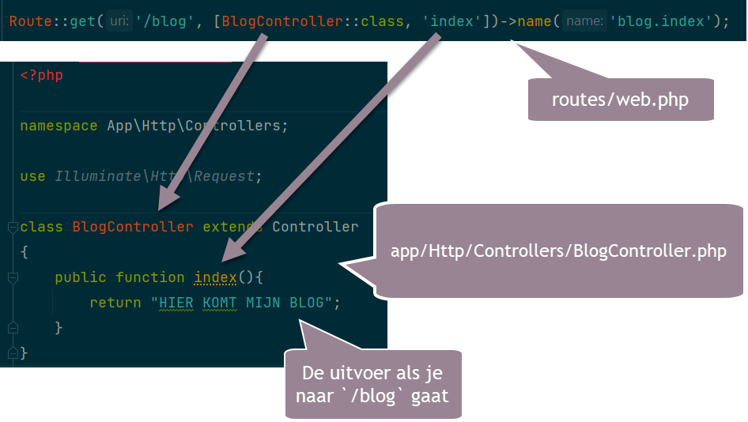

## Overview: Wat zijn routes?
{: .text-green-100 .fs-6 }

Het bestand met de *routes*: `web/routes.php` bevat alle routes voor je website.
Het is als het ware de menukaart van je website.

- Voor elke pagina of URL op je website **MOET** je een route definiëren.
- Die zet je in het bestand `routes/web.php`.
- Alleen als het hier staat kun je naar die pagina toe op je website.

### Wat heb je nodig om een route te laten werken?

1. Een URL (die mag je zelf bedenken, dus verzin een SEO vriendelijke url)
2. Een request method (GET,POST). Meestal gebruik je GET. Voor form afhandeling meestal POST.
3. Een controller class. 
4. Een public function (method) in de class die de code voor jouw route bevat.
5. Een view die de HTML bevat voor de pagina bij de route.

### Voorbeeld

Hier een voorbeeld hoe je **GET** een route maakt naar de url **/blog** die afgehandeld wordt door de function **index** in een **BlogController**.
De route heeft een (interne naam) *blog.index* (hiermee kun je er makkelijker naar linken in je code).

---

In de [volgende opdracht](routes-controllers-views) maak je de routes en controllers voor alle pagina's op je website.

---



